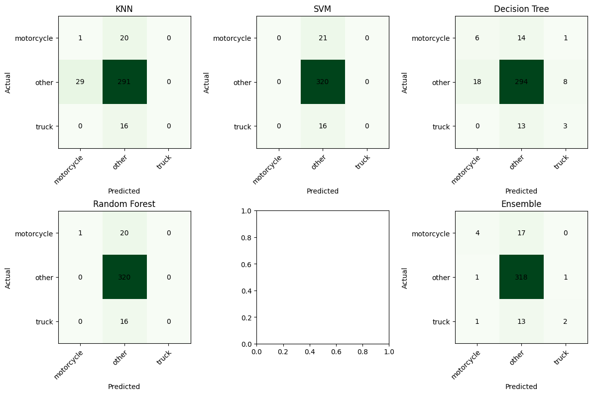

# 🚦 Traffic Monitoring System using Traditional Machine Learning

## Overview

This project aims to develop a traffic monitoring system using traditional machine learning techniques. The system detects motorcycles and trucks in a video feed and utilizes machine learning models for classification.

## Introduction

The project involves designing and formulating a traffic monitoring tool based on traditional machine learning techniques such as KNN, SVM, Decision Trees, and Random Forest.

## Dataset Acquisition

### 📹 Video Source

The video source for the project is `data/traffic_output.avi`.

## Data Preprocessing and Annotation

### ✍️ Image Annotation

Frames from the video are extracted and annotated to label motorcycles and trucks for training purposes using CVAT and LabelImg

## Feature Extraction

### 📊 Identified Features

- Color histograms
- Edges
- SIFT (Scale-Invariant Feature Transform)
- SURF (Speeded-Up Robust Features)
- Pixel values

## Model Training

### 🤖 Traditional Machine Learning Models

- K-Nearest Neighbors (KNN)
- Support Vector Machine (SVM)
- Decision Trees
- Random Forest

## Model Evaluation

Performance metrics such as confusion matrices, AUC, Precision, Recall, and F1 score are used to evaluate the trained models.

| Model          | AUC      | Precision | Recall   | F1 Score |
|----------------|----------|-----------|----------|----------|
| Random Forest  | 0.883361 | 0.864539  | 0.899160 | 0.853971 |
| Decision Tree  | 0.597045 | 0.846874  | 0.848739 | 0.847535 |
| SVM            | 0.921821 | 0.803459  | 0.896359 | 0.847370 |
| KNN            | 0.468618 | 0.799638  | 0.817927 | 0.808614 |

## Ensemble Model Building

The top three performing models are selected to build an ensemble model using techniques like voting or averaging.

## Results Comparison

The performance of the ensemble model is compared with individual models to assess improvement.

Model            | AUC      | Precision | Recall  | F1 Score |
------------------------------------------------------------
Ensemble         | NaN      | 0.888     | 0.907   | 0.880    |
Decision Tree    | 0.650    | 0.866     | 0.857   | 0.860    |
Random Forest    | 0.894    | 0.864     | 0.899   | 0.853    |
SVM              | 0.920    | 0.803     | 0.896   | 0.847    |
KNN              | 0.468    | 0.799     | 0.817   | 0.808    |

## Future Work

Suggestions for future work include enhancements to the system, such as incorporating deep learning techniques for improved accuracy and efficiency.

